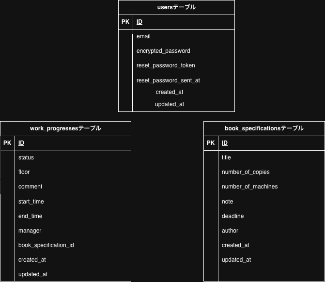
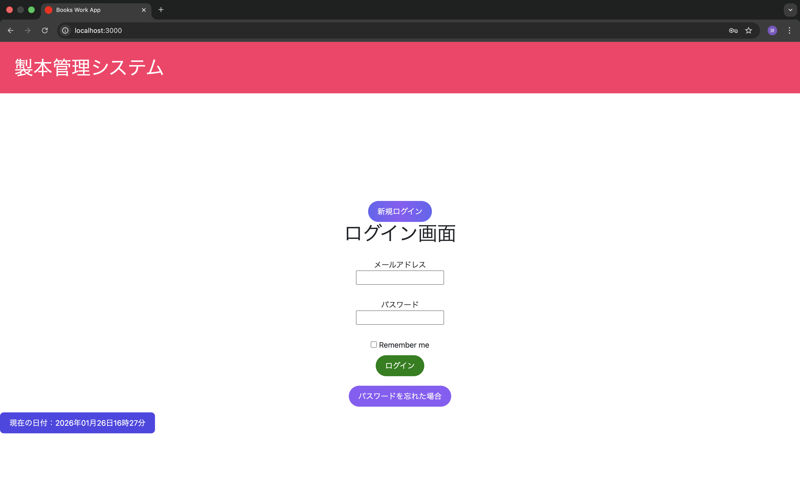
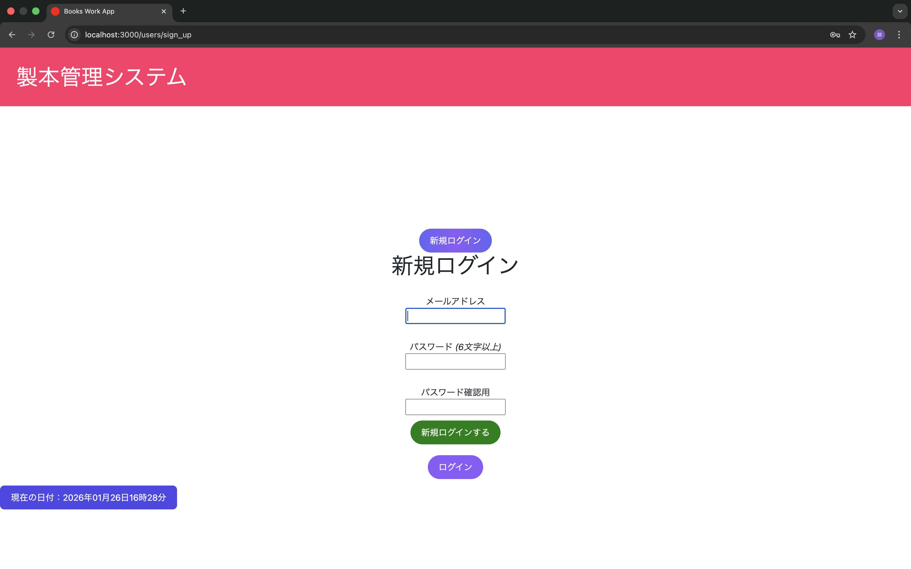
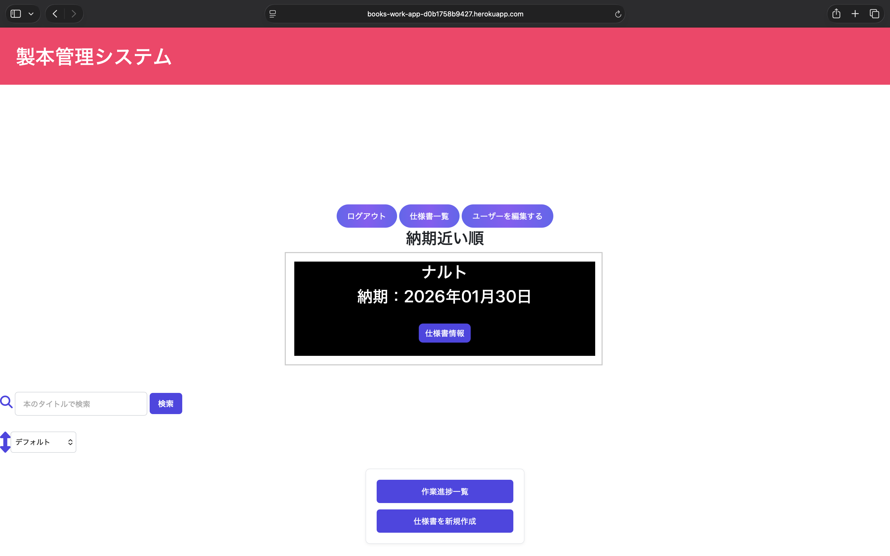
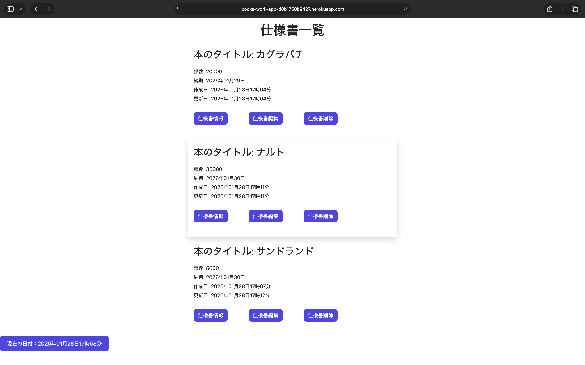
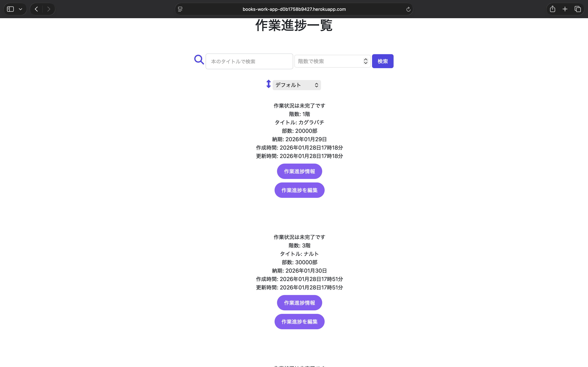

テストとしてメールアドレス,パスワードを用意しました。
<h1>test@example.com</h1>
<h1>password</h1>

## 開発背景
前職の製本業務では、作業場所が分かれていたため、各工程の進捗状況が把握しづらい課題がありました。
進捗確認を個別確認で行う場面が多く、確認回数の増加や情報共有漏れが発生していました。
そこで、作業ごとの仕様情報と作業状況を一元管理できるアプリケーションを開発しました。
各工程の進捗状況をリアルタイムで確認できるようにし、現場全体の状況を把握しやすい構成を意識しています。

## 力を入れたこと
納期が近い案件を優先的に確認できるよう、納期順で自動表示されるスライド機能を実装し、進捗確認を効率化しました。
また、リアルタイムで状況を把握しやすいよう、現在時刻表示やステータス表示を取り入れ、直感的に操作できるUIを意識して開発しました。

## 苦戦した点と乗り越えたこと
スライド機能の実装時に、表示する情報量によってUIが画面からはみ出し、レイアウトが崩れる問題が発生しました。
CSSの調整だけでは解決できなかったため、表示領域を見直し、見やすいUIを意識して改善を行いました。
また、利用者が直感的に状況把握できるよう、視認性を重視したデザイン調整も行っています。

## 今後の改善案
現在は基本的な進捗管理機能を中心に実装していますが、今後は通知機能や担当者別の管理機能を追加し、業務全体の進捗状況をよりリアルタイムに把握できる仕組みへと改善したいと考えています。

## 使用機能
- アカウント・仕様書・作業進捗の登録、閲覧、編集、削除機能
- 登録時の入力制限（日付制御など）によるデータ整合性の担保
- 検索機能および並び替え機能
- 納期の近い順に表示するスライド機能
---

## 使用技術
### バックエンド
- Ruby on Rails 8.0.4
- Ruby 3.3.3

### フロントエンド
- HTML / CSS / JavaScript
- Bootstrap
- Dart Sass Rails
- Font Awesome

### 認証機能
- Devise

### データベース
- SQLite3（開発環境）
- PostgreSQL（本番環境）
---

## 開発・デプロイ環境
- Git / GitHub（プルリクエストによる開発管理）
- Heroku（デプロイ）
---

🟥ER図 

🟥デモ画像

🟥操作方法 
初めはログイン画面になる。 
新規アカウント登録する。 
アカウントが作成され仕様書を登録、情報閲覧、編集、削除する。 
仕様書を登録したデータに作業進捗を登録、情報閲覧、編集する。 
ログアウトできる。 
以降登録したメールアドレス、パスワードでログインする。
